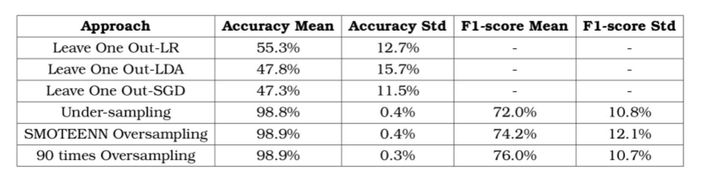
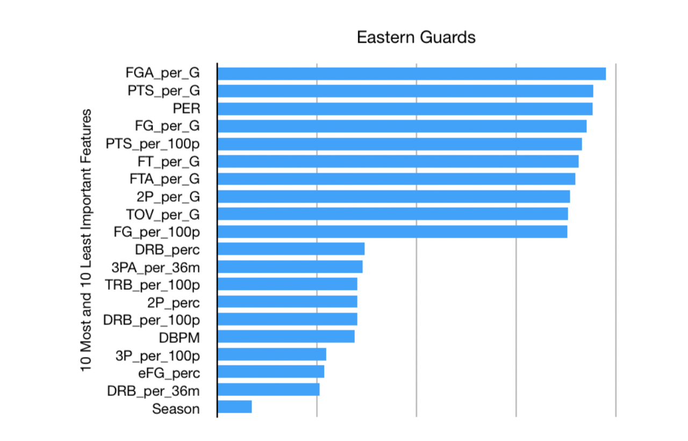
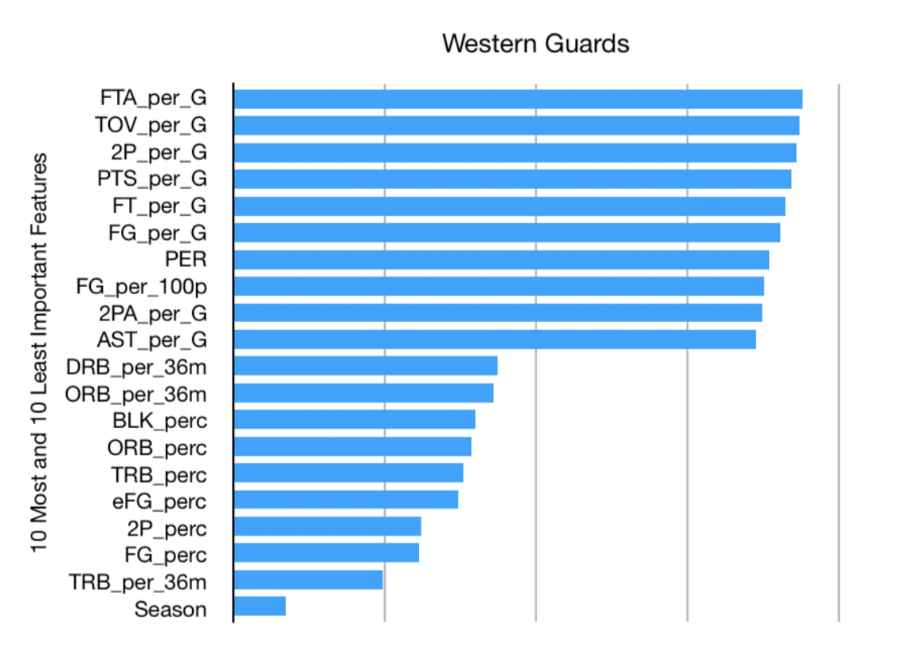
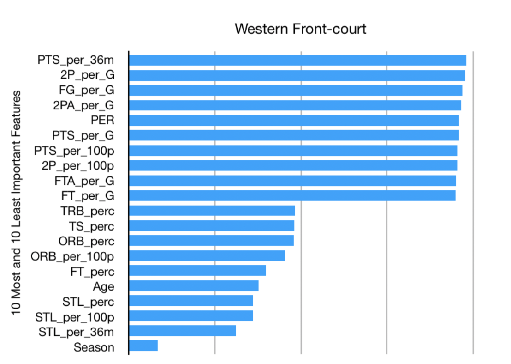
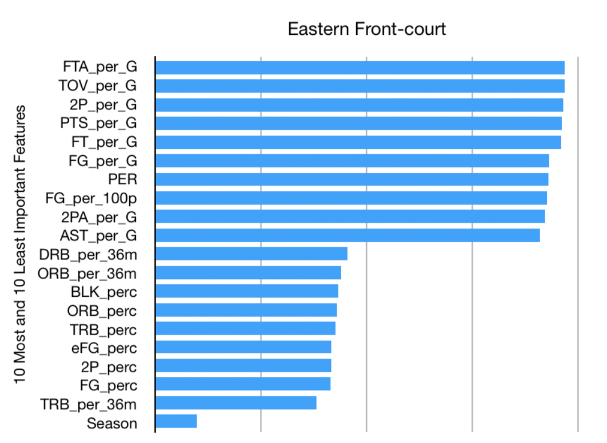
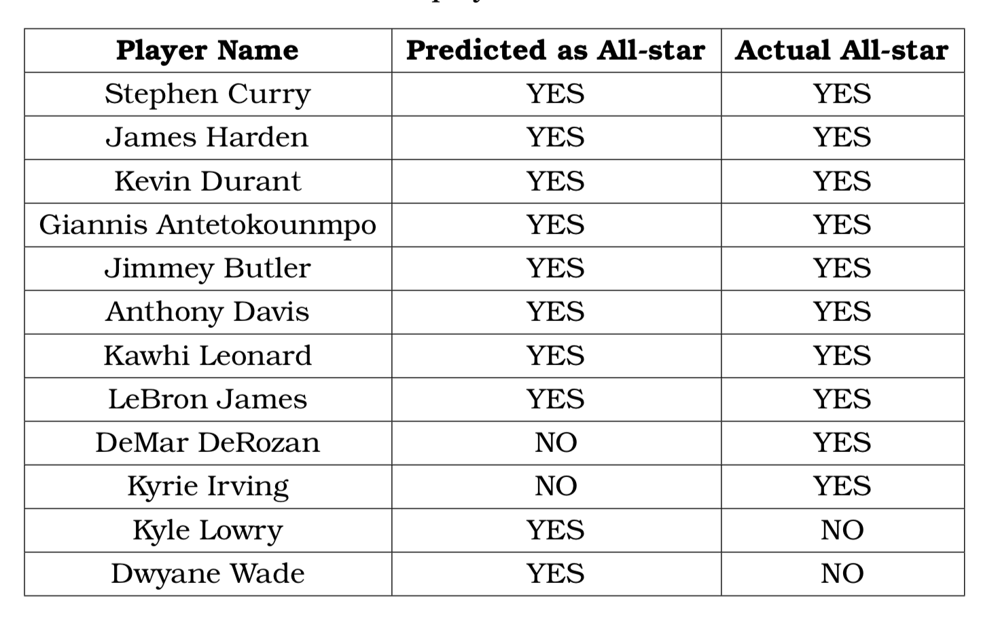

# **Identifying All-star Players in NBA**
Code implementation of my  [Bachelor Thesis](https://drive.google.com/file/d/1bLekZIQ1gqqlwWBIJG0i2kNqHtN4plQu/view?usp=sharing)
## **Aims:-**
1. Classifying NBA players into All-star or regular players using sport analytics and machine learning classifiers. 
2. Identifying the most important features of All-star
players.
## **Background:-**
National Basketball Association (NBA) All-star game is a game played every February between chosen players from each conference (western and eastern). At each season the top ten highly voted players are the one who will join the All-star game. Players selection is done by pure voting which is done by the fans and the media. There are no selection criteria exists and from here comes the challenge of discovering the hidden criteria that the voters use to choose the players they want to see them playing together. 
## **Classifiers Used:-**
1. Logistic Regression
2. Stochastic Gradient Decent
3. Linear Discriminant Analysis
4. K-Nearest Neighbours 

## **Class Imbalance Problem:-**
All-star players represents about 2.26% of the total number of players in every data file. Obviously, dataset suffers from Class Imbalance problem as classes distributions are highly imbalanced. The following are techniques used to overcome class imbalance problem:-
1. Under-sampling
2. Oversampling using SMOTEENN libaray
3. Oversampling by duplicating underrepresented class

## **Summary of Results:-**

## **Most Important Features:-**
The following charts show the 10 most important features and 10 least important features for each player type which are Western Guards, Eastern Guards, Eastern Front-court and Western Front-court. All abbreviations can be found in [Basketball-Reference website glossary](https://www.basketball-reference.com/about/glossary.html.)

Eastern Gaurds | Western Gaurds 
------------ | ------------- 
 |  

Western Front-Court | Eastern Front-Court
------------- | -------------
 | 

Using the above ranking figures, we can conclude that :-
1. Player Efficiency Rating (PER) is one of the most important features for all player types.
2. Voters do not pick randomly but based on the player performance. They want to see players with the highest performance metrics playing together. 
3. Voters from eastern and western conferences focus on similar features for different player types.

## **All-star’17 Case Study:-**
the classifier will train on all seasons from 2000 to 2017 except records of 2016-2017 season as they will be the test dataset. The following table shows which players predicted by the classifier to be All-star and which players were actual All-star.

As shown in the above table, the classifier well predicted 8 players and failed to predict 2 players. In Jan. 19, 2017 an article ["Kyle Lowry should be starting for East in NBA All-Star Game"](https://www.usatoday.com/story/sports/nba/raptors/2017/01/19/kyle-lowry-raports-eastern-conference/96802978/.2017.) was published at USA TODAY which discusses that Kyle Lowry deserves to be an All-star starter. Such article proves the high performance of the classifier as Kyle Lowry classified as an All-star player for 2017. The following figure shows a snapshot of the article.
